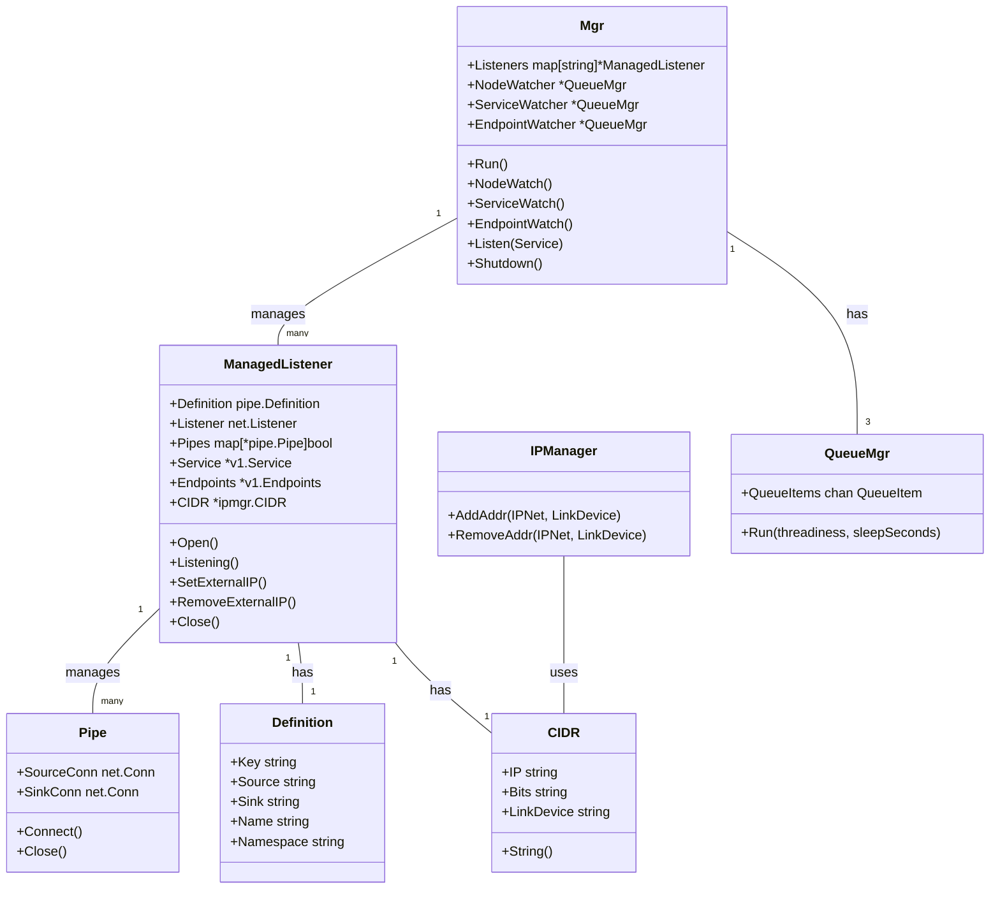
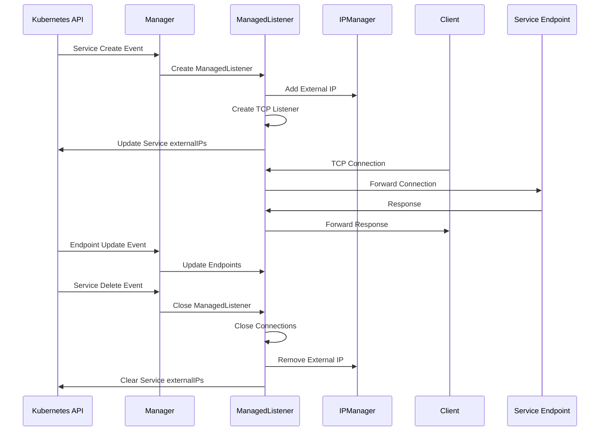
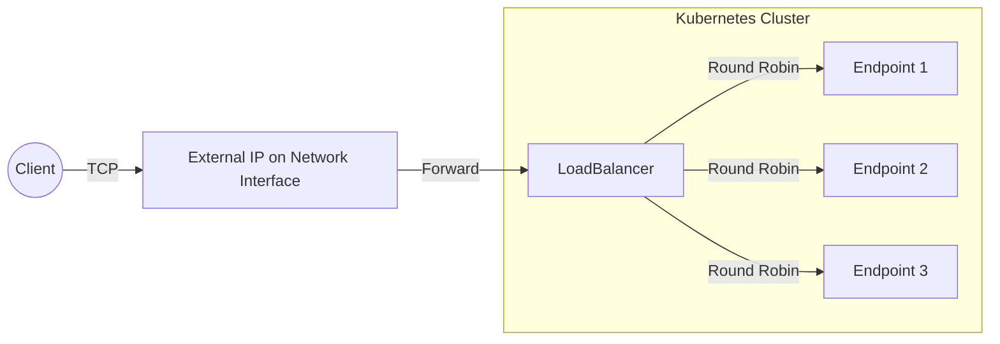
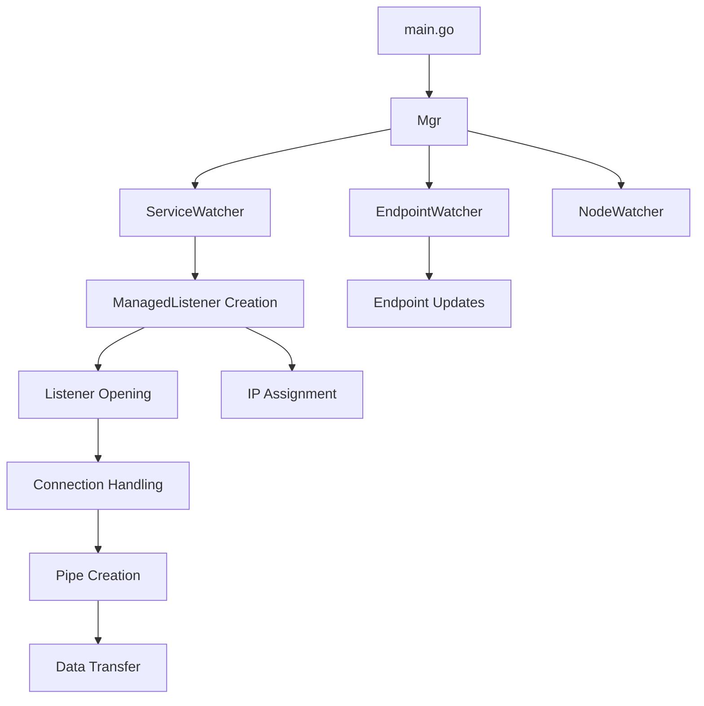
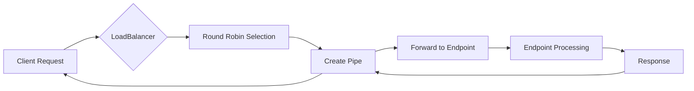
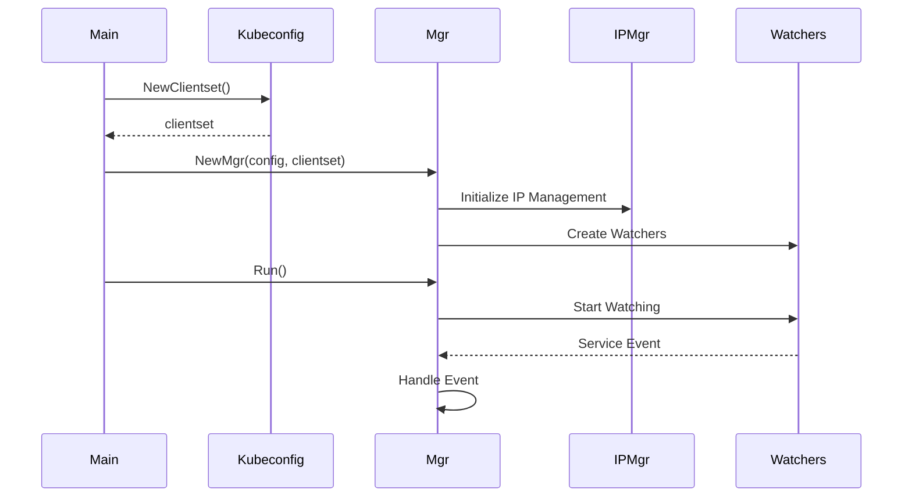
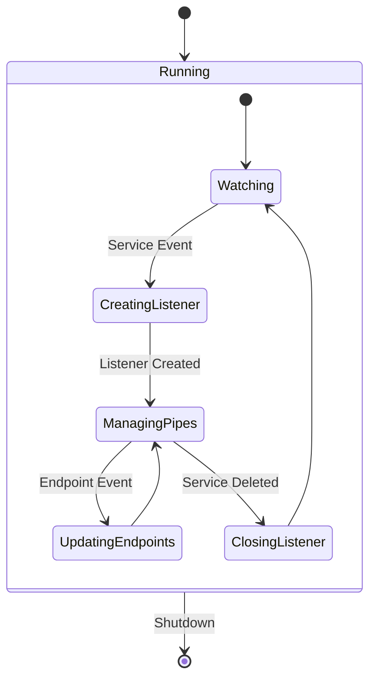

# Architecture Diagrams

This document contains architecture diagrams for the Kubernetes External LoadBalancer.

## System Components

## Operational Flow

## Network Architecture

## Component Interactions

## Data Flow

## Initialization Sequence

## State Transitions

